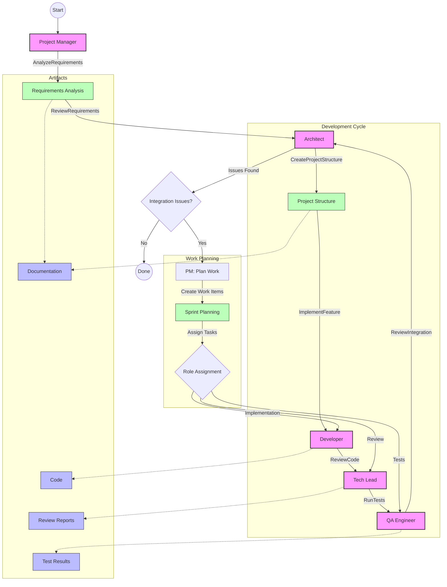

# AICA - AI Coding Assistant

AICA is an AI-powered coding assistant that helps generate and manage software projects. It uses a team of specialized AI agents to analyze requirements, design architecture, implement features, and ensure code quality.

## Features

- Multi-agent system with specialized roles:
  - Project Manager: Analyzes requirements and coordinates development
  - Architect: Creates project structure and technical design
  - Tech Lead: Implements core functionality
  - Developers: Implement specific features
  - Code Reviewer: Ensures code quality and standards
  - QA Engineer: Verifies test coverage and runs tests

- Flexible LLM support:
  - AWS Bedrock with Claude (default)
  - OpenAI GPT-4 and GPT-3.5
  - Easy to extend with new providers

- Project workspace management:
  - Organized directory structure (src, docs, tests)
  - Artifact generation and management
  - Clean workspace handling

## Agent Workflow

AICA uses a sophisticated multi-agent workflow to manage the software development process. View the [workflow diagram](workflow.mmd) directly or see it rendered below:



The workflow shows how:
1. Project Manager analyzes requirements and coordinates with the Architect
2. Development cycle flows through Developer → Tech Lead → QA Engineer
3. Integration issues are handled by creating new work items and feeding them back into the cycle
4. Artifacts (documentation, code, reviews, test results) are generated throughout the process

## Installation

```bash
uv pip install -e .
```

For development:
```bash
uv pip install -e ".[dev]"
```

## Configuration

AICA uses a configuration file to manage settings. Create it at `~/.aica/config.yaml`:

### Using AWS Bedrock (Default)

```yaml
llm:
  provider: bedrock
  bedrock_model_id: anthropic.claude-3-5-sonnet-20241022-v2:0  # Claude 3.5 Sonnet
  bedrock_region: us-east-1  # your AWS region
  bedrock_max_tokens: 32768  # maximum tokens to generate
```

Make sure you have AWS credentials configured either through:
- Environment variables (`AWS_ACCESS_KEY_ID`, `AWS_SECRET_ACCESS_KEY`)
- AWS credentials file (`~/.aws/credentials`)
- IAM role (if running on AWS)

### Using OpenAI (Alternative)

```yaml
llm:
  provider: openai
  openai_api_key: your-api-key
  openai_model: gpt-4-turbo  # or other available models
```

## Usage

1. Create a prompt file (`prompt.md`) describing your project requirements:
```markdown
Please generate a python package that completely conforms to the specification...
```

2. Optionally create a specification file (`spec.md`) with detailed requirements:
```markdown
# Project Specification

## General Requirements:
- Feature 1
- Feature 2
...
```

3. Run AICA:
```bash
# Basic usage
aica generate prompt.md

# With specification
aica generate prompt.md --spec spec.md

# Custom output directory
aica generate prompt.md --output ./my-project

# Custom config file
aica generate prompt.md --config ./my-config.yaml
```

## Project Structure

AICA generates projects with the following structure:
```
output/
├── src/           # Source code
├── docs/          # Documentation and artifacts
└── tests/         # Test files
```

## Development

1. Install development dependencies:
```bash
uv pip install -e ".[dev]"
```

2. Run tests:
```bash
pytest
```

3. Run code quality checks:
```bash
pre-commit run --all-files
```

## License

MIT License
